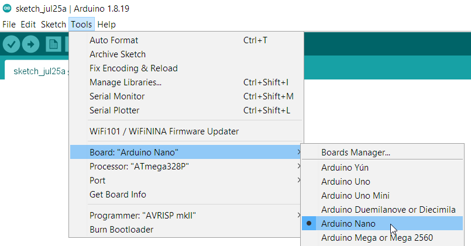
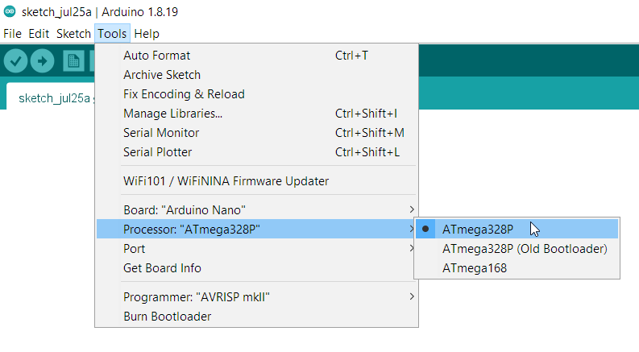
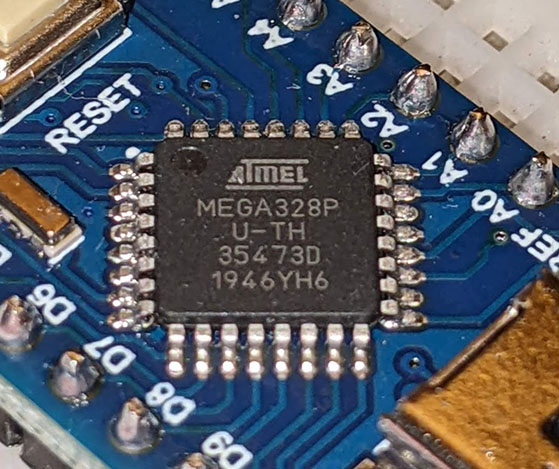
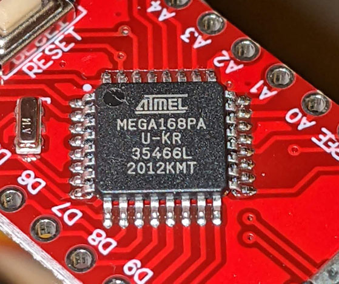
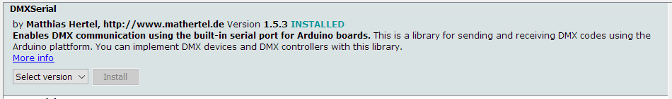
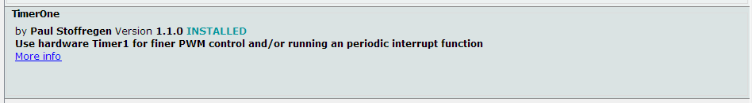

# Arduino folder for DMX controller

## Arduino sketches in this folder


* `read_sliders_and_print_to_serial` - for testing slide potentiometers.
* `send_DMX_from_sliders` - use this for normal operation of the DMX controller.
* `send_random_DMX` - for testing the RS-48s transceiver.

## Instructions 

Once you've installed & launched the Arduino software and connected your Arduino board to your computer:

### Choose processor

Click Tools > Board and choose "Arduino Nano" (not Micro, not Mini.)



Once the Arduino Nano board is selected, the Tools menu will have a new sub-menu called Processor:



If the processor selected in the Arduino software doesn't match the processor on your board, uploading the sketch won't work.

When it is not working, the horizontal teal bar in the Arduino software which separates the code editor from the console will say "Uploading..." but nothing will happen. You might get an error message like:

```
avrdude: stk500_recv(): programmer is not responding
```
or 
```
avrdude: stk500_getsync() attempt 1 of 10: not in sync: resp=0x00
```
(see the Arduino help page ['Error: avrdude' when uploading](https://support.arduino.cc/hc/en-us/articles/4401874331410--Error-avrdude-when-uploading#avrdude-stk500_recv-and-stk500_getsync).)

When the correct Processor is selected, the upload should finish in a few seconds.

You can just try all three processor options. If the upload is not working, unplug the USB cable connecting the Arduino board to your computer and the upload process wil immediately stop.

If you want to check which processor is on your board, look at the big black square chip mounted at a 45-degree angle on the top of the Arduino Nano. It will either say "MEGA328" or "MEGA168". You will need magnification, and you will need to tilt the board to get good lighting.

<table>
<tr>
<td></td>
<td></td>
</tr>
</table>

if the chip says 328, you have to try the both the "ATmega328P" and "ATmega328P (Old Bootloader)" processor options.


### Install libraries

1. Click Tools > Manage Libraries.

1. Install the DMXSerial library:

    

   Links to documentation:

   * https://www.arduino.cc/reference/en/libraries/dmxserial/
   * https://github.com/mathertel/DmxSerial


1. Install the TimerOne library:

    

    Link to documentation: 

    * https://www.arduino.cc/reference/en/libraries/timerone/
