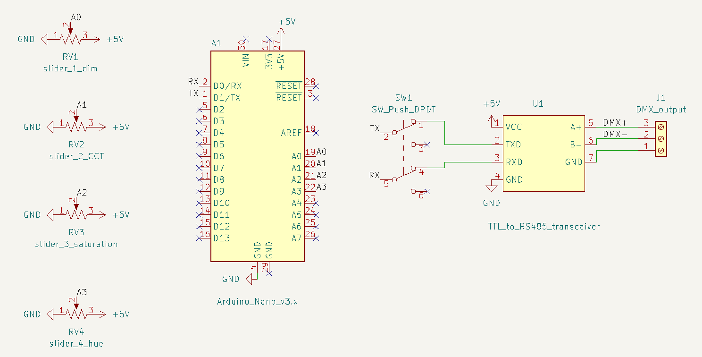

# KiCad project

Here's a screenshot of the schematic:

There's a DPDT switch is to disconnect the Arduino from the RS485 transceiver. The TX & RX pins must be disconnected form everything otherwise you can't upload sketches.[[1]](https://forum.arduino.cc/t/cant-upload-code-when-tx-rx-pins-are-connected/341202/4)[[2]](https://arduino.stackexchange.com/a/86)