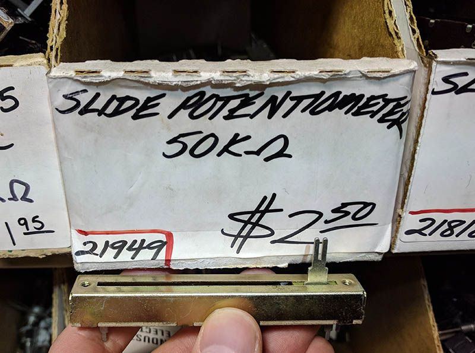

# Slide potentiometer info

I got the slide potentiometers from HSC Electronics in 2018. The only marking on them is "OAK A50K".

They have a logarithmic resistance curve (intended for audio applications) which is not actually what we want for a DMX controller.

To commemorate the closing of HSC, I am including this photo of the original box with the price:

