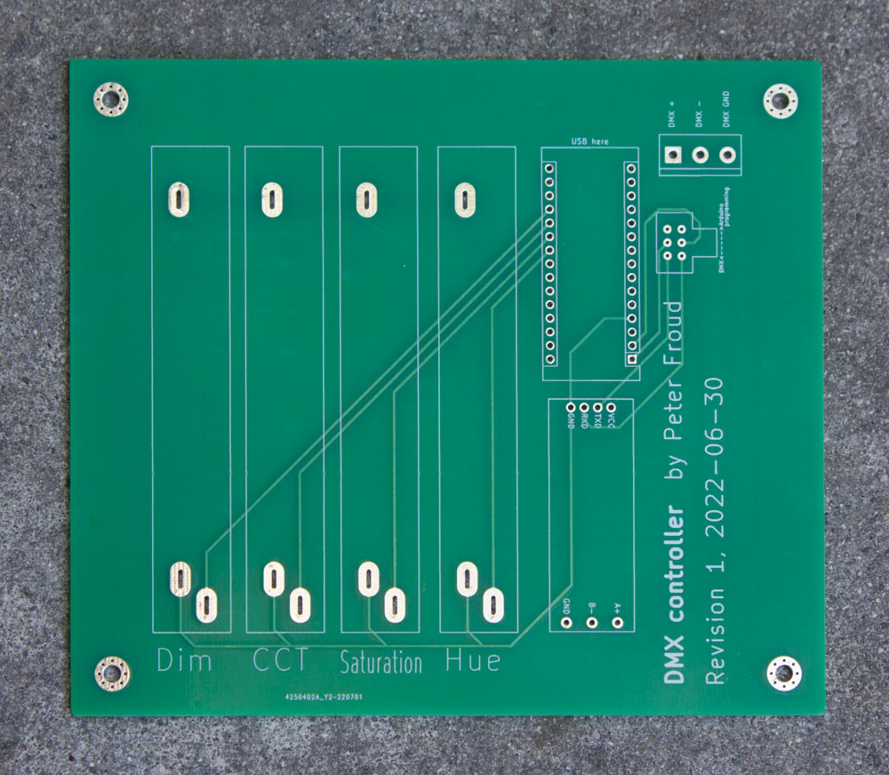
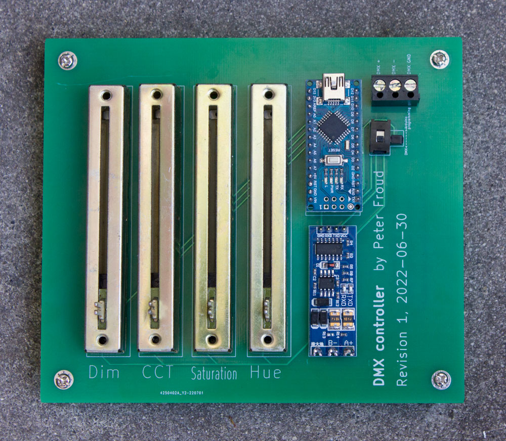

# DMX controller

Four-channel DMX controller.

<table>
<tr>
<td></td>
<td></td>
</tr>
</table>

Parts: 

* Arduino Nano (the one with ATmega328) (Not Arduino Micro, which has ATmega32U4)
    * Uses DMXSerial library by Matthias Hertel http://www.mathertel.de/Arduino/DMXSerial.aspx
* Four slide potentiometers
* TTL-to-RS485 transceiver https://www.aliexpress.com/item/2251832519311238.html
* A slide switch to disconnect the Arduino's RX & TX pins so it can be programmed over USB
