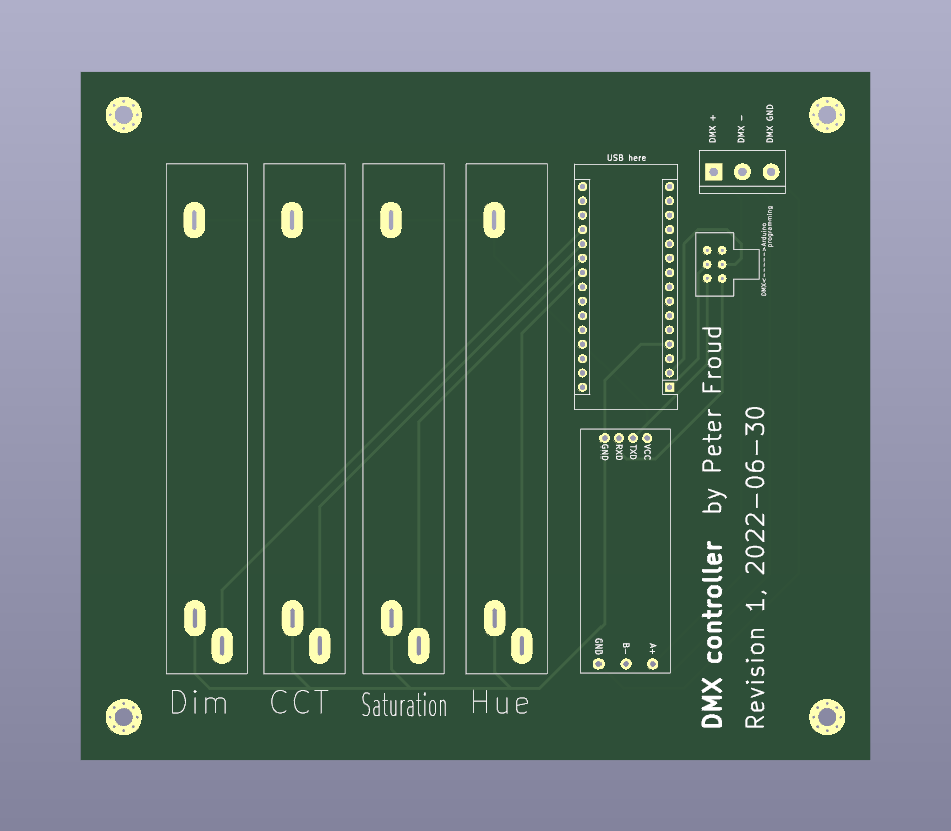
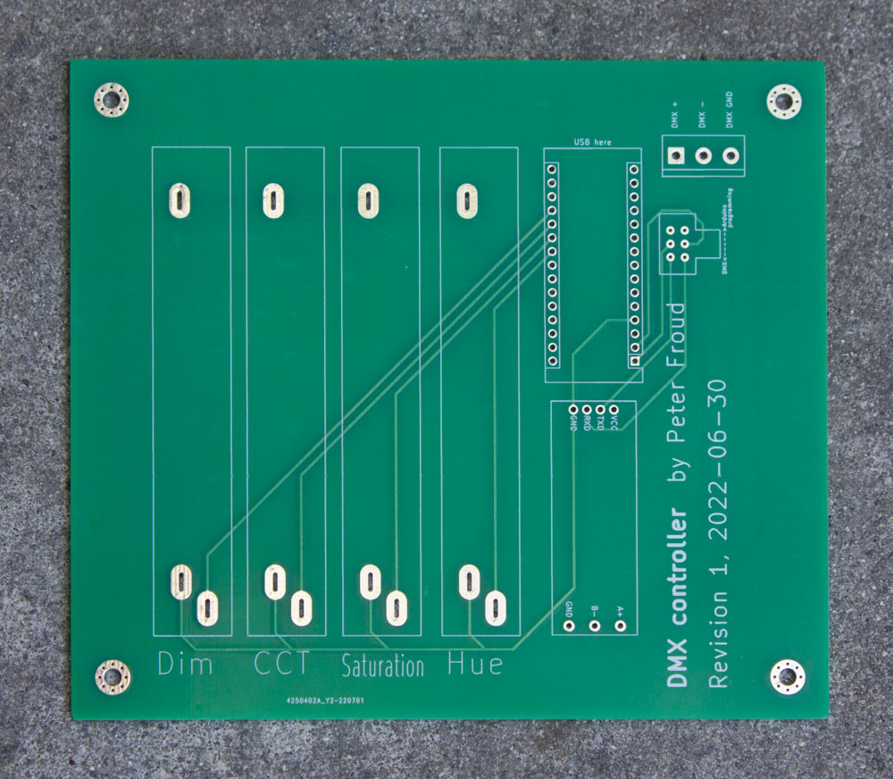
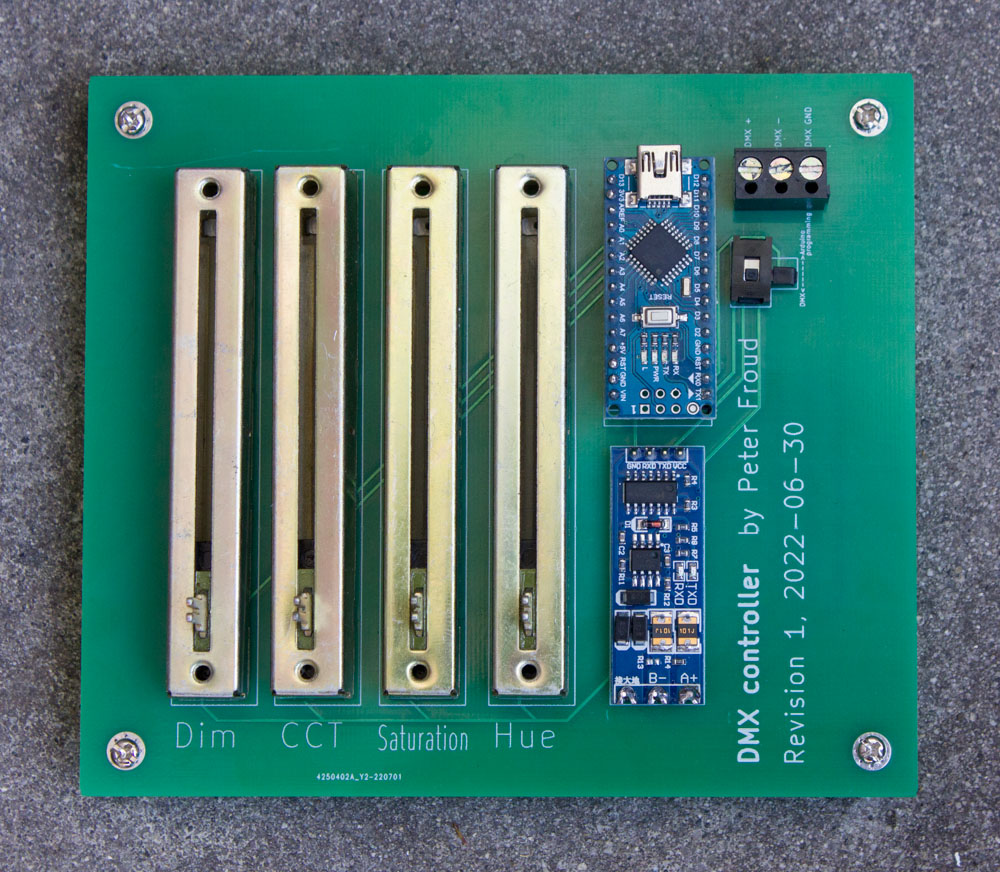
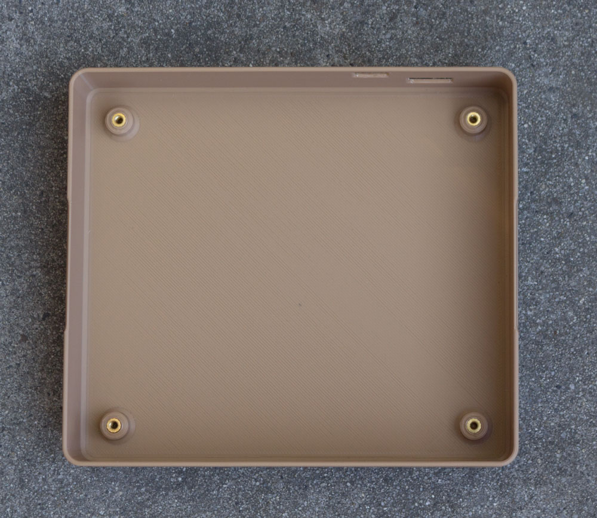
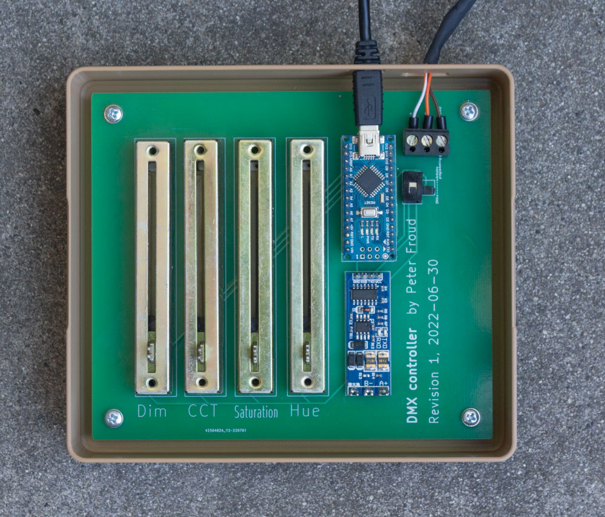
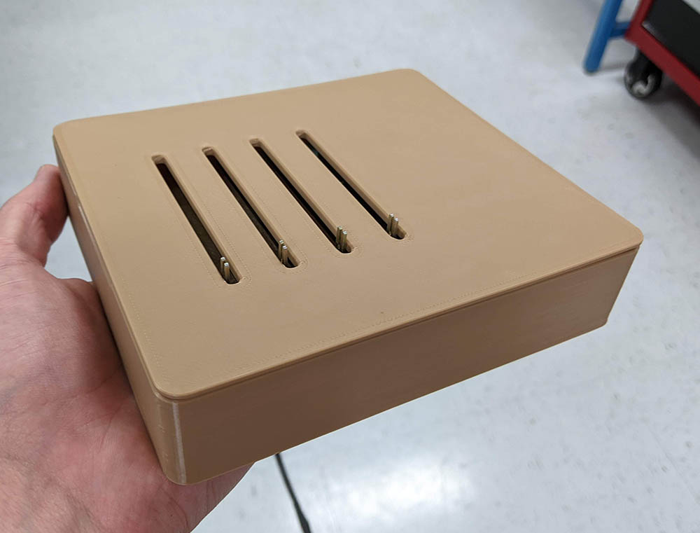
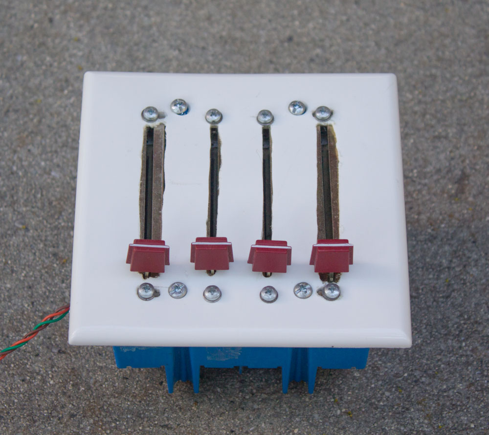
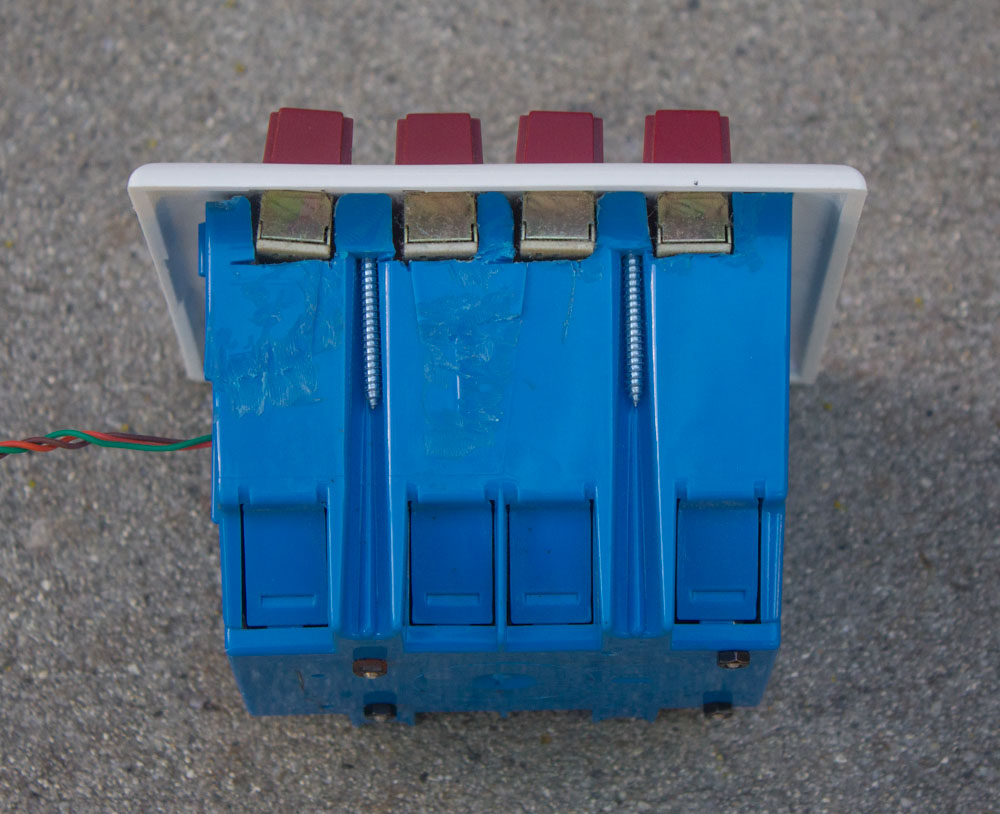
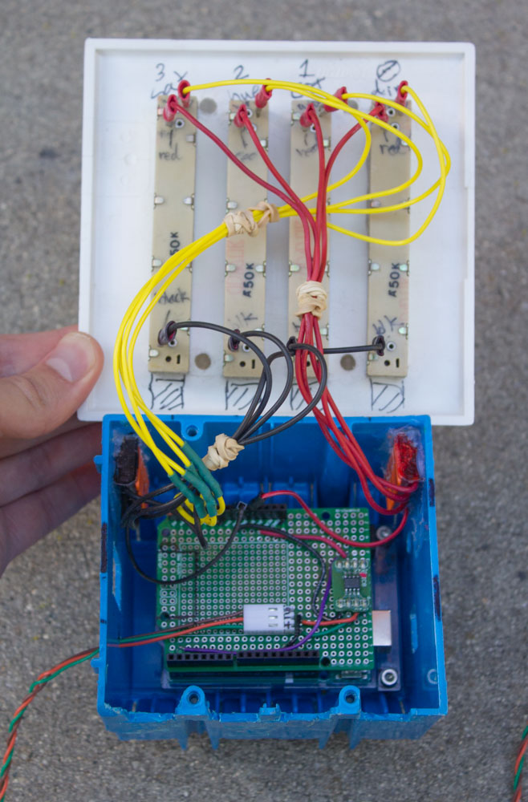

# DMX controller

[DMX](https://en.wikipedia.org/wiki/DMX512) is an industry-standard protocol used for controlling stage lighting (and other things). This project is a rudimentary four-channel DMX controller. 

When working at an LED lighting company, I got some lamps from scrap and made some of them work enough to be useful. Those lamps are primarily controlled with DMX.

This project was my first time designing a PCB, and my first time doing 3D printing!!!

<table>
<tr>
<td></td>
<td></td>
<td></td>
</tr>
</table>

## Parts

* [Arduino Nano](https://en.wikipedia.org/wiki/Arduino_Nano) (not Micro, not Mini)
    * [DMXSerial library by Matthias Hertel](http://www.mathertel.de/Arduino/DMXSerial.aspx)
* Four slide potentiometers
* [TTL-to-RS485 transceiver from AliExpress](https://www.aliexpress.com/item/2251832519311238.html)
* A switch to disconnect the Arduino's RX & TX pins from the RS485 transceiver so the Arduino can be programmed over USB

The PCB was designed using [KiCad](https://www.kicad.org/) version 6 and fabricated by JLCPCB.

## Enclosure

<table>
<tr>
<td></td>
<td></td>
<td></td>
</tr>
</table>

I used Fusion 360 to design an enclosure to be 3D-printed.

The enclosure is not very good for multiple reasons. It was mostly a test to see if I can make something which fits the board and 3D-prints okay. Happily, my first attempt was successful.

The enclosure was printed on a Creality CR-6 SE using FilaCube PLA 2 filament.

## Prototype

In 2018, I made a prototype DMX controller without a PCB. It was pretty bad but it succeeded as a proof-of-concept.

<table>
<tr>
<td></td>
<td></td>
<td></td>
<td>
</tr>
</table>

The main parts used for the prototype were:

* [Arduino Uno](https://en.wikipedia.org/wiki/Arduino_Uno)
    * [DMXSerial library by Matthias Hertel](http://www.mathertel.de/Arduino/DMXSerial.aspx)
    * Prototype shield 
* [ST1480AC RS-485 transceiver](https://www.st.com/en/interfaces-and-transceivers/st1480ac.html)
* [3-gang electrical outlet box](https://www.homedepot.com/p/100404028)
* [Wago lever-nuts](https://www.wago.com/ca-en/lp-221)
* Three-pin [Molex KK 254](https://www.mattmillman.com/info/crimpconnectors/#kk100) connector

