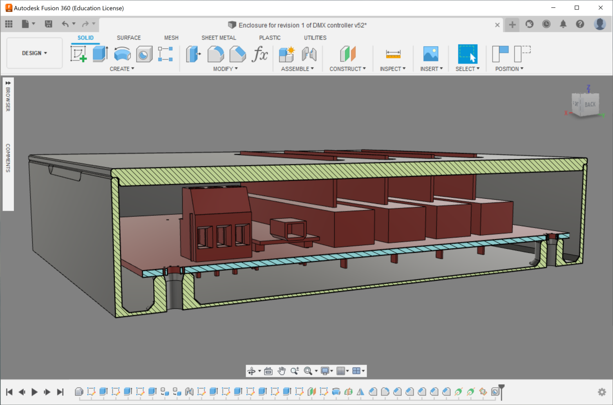
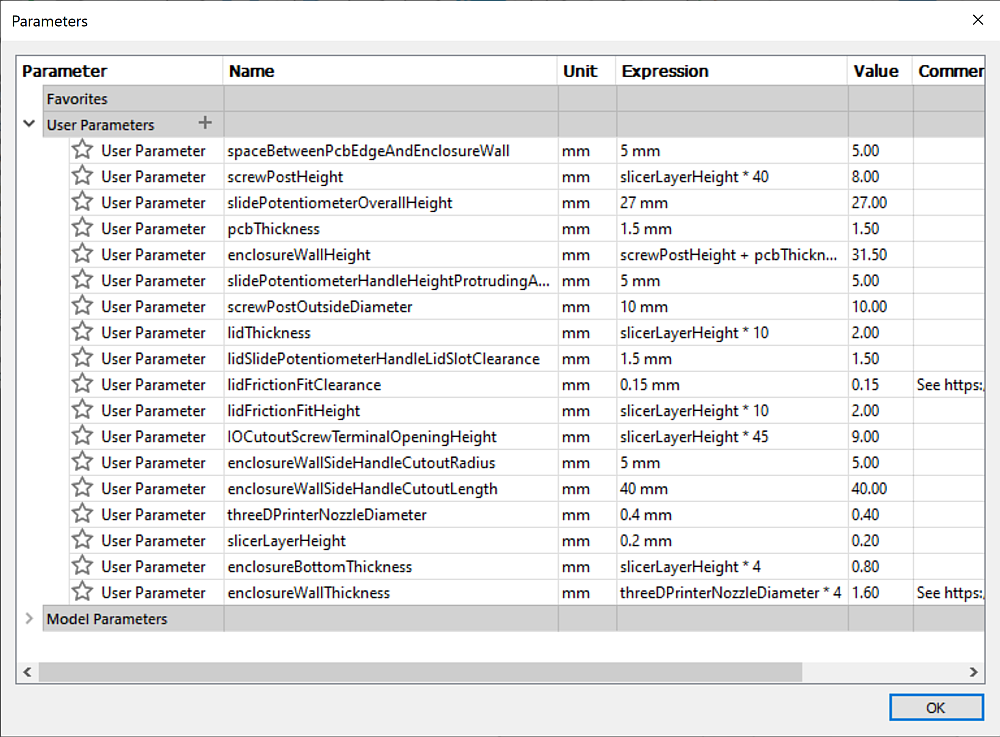

# Enclosure for revision 1

## File formats

* `.f3d` is Autodesk Fusion 360 Archive File.
* `.step` is [ISO 10303-21](https://en.wikipedia.org/wiki/ISO_10303-21).
* .`3mf` is [3D Manufacturing Format](https://en.wikipedia.org/wiki/3D_Manufacturing_Format).

## Screenshots

Here's a screenshot from Fusion 360 showing a cross-section of the enclosure:

I used lots of parameters!

